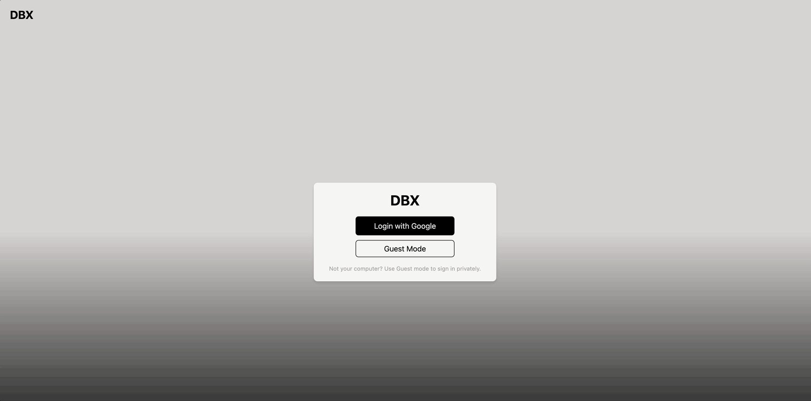
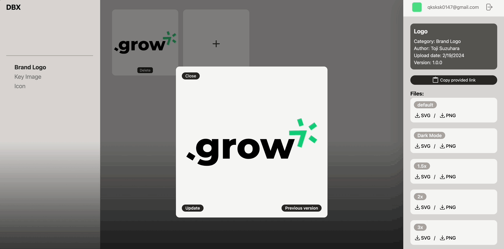
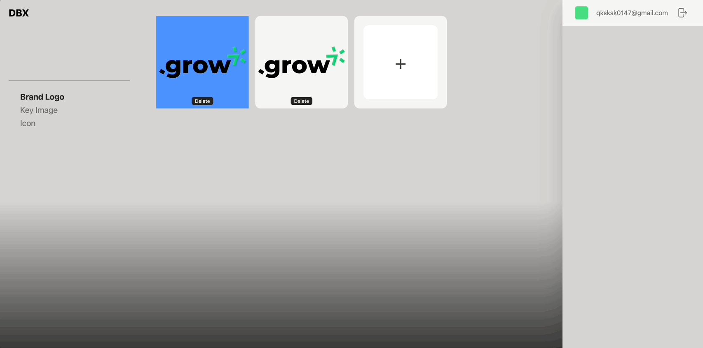

<h1 align="center">
  
</h1>

<br>

DBX는 디자이너와 개발자가 브랜드 경험(BX)의 일관성을 유지하며 그래픽 리소스와 버전을 효율적으로 관리할 수 있게 지원하는 웹 서비스입니다. BX의 일관성은 고객 신뢰 및 브랜드 가치를 강화하는 데 필수적입니다. 그러나 이를 유지하기 위해서는 상당한 노력, 인력, 그리고 많은 시간이 소요됩니다.

DBX는 이 과정을 직관적으로 단순화하고, 적은 노력으로도 일관성을 쉽게 유지할 수 있도록 다양한 기능을 제공합니다. 언제 어디서나 중앙집중식 라이브러리를 통해 필요한 리소스에 쉽게 접근하고, 작업의 결과물을 실시간으로 공유하세요.

DBX를 사용함으로써, 브랜드 정체성 구축 및 유지가 더욱 간편해지며, 개인과 팀 모두 핵심 업무에 더 많은 시간을 할애할 수 있게 되어 프로젝트의 속도와 품질이 향상됩니다.

## 언어별 보기

- [한국어](README.ko.md)
- [English](README.md)

## 목차

- [개요](#개요)
- [주요 기능 및 기술 스택](#주요-기능-및-기술-스택)
  - [그래픽 리소스 버전관리](#1-그래픽-리소스-버전관리)
  - [파일 업로드 및 다운로드](#2-파일-업로드-및-다운로드)
  - [리소스 고정 URL 제공](#3-리소스-고정-URL-제공)
- [데모](#데모)
- [도전 및 학습](#도전-및-학습)
  - [데이터 모델링과 관계 설정](#data-modeling-and-relationship-setting)
  - [파일 다운로드 시스템 구현](#implementing-file-download-system)
  - [리팩토링 그리고 컴포넌트의 책임 분산](#decentralizing-component-responsibilities)
  - [API 엔드포인트의 오류 처리 강화](#enhanced-error-handling)
- [주요 포인트 및 성과](#주요-포인트-및-성과)
- [설치 및 실행 지침](#설치-및-실행-지침)
  - [프론트엔드](#installation-frontend)
  - [백엔드](#installation-backend)
- [스케줄](#스케줄)
- [프로젝트 기여도](#프로젝트-기여도)
- [제작자](#제작자)

## 개요

**배경**:

팀 프로젝트 아이디어를 찾기 위한 구글링이 한계에 도달했을 때, 저희는 새로운 시각과 신선한 아이디어가 필요함을 느꼈습니다. 이에 지인들과의 대화를 통한 정보수집을 시작했습니다. 대부분의 아이디어는 이미 한 번쯤 고민해 본 익숙한 것이었지만, 가끔 흥미로운 주제도 발견할 수 있었습니다. 하지만 여전히 확실한 주제를 결정하지 못하였고, 피로감은 점차 쌓여만 갔습니다.

그러던 중, 우연히 인근 회사에서 일하는 친구와 커피타임을 가지며 프로젝트 주제에 관해 이야기할 기회가 생겼습니다. 이 친구는 UI/UX 디자이너로 평소 개발자와의 협업이 잦았고, 이 과정에서 개선되었으면 하는 몇 가지 사항들을 공유해주었습니다. 이 우연한 대화는 저희에게 새로운 영감을 제공했고, 실질적인 협업 과정에서 발견된 문제점들이 DBX 개발의 출발점이 되었습니다.

**프로젝트 목표 및 동기**:

DBX 프로젝트는 디자이너와 개발자 간의 협업을 원활하게 하여 브랜드 아이덴티티(BI)의 일관성을 효율적으로 관리하고 유지할 수 있는 플랫폼을 제공하는 것을 목표로 합니다. 이 웹 서비스는 그래픽 리소스와 버전 관리를 단순화하여, 모든 팀원이 최신 상태의 디자인 가이드라인과 자산에 쉽게 접근하고 활용할 수 있도록 지원합니다.

동기는 실제 현장에서 발생하는 디자이너와 개발자 간의 커뮤니케이션 문제와 협업의 어려움에서 비롯되었습니다. 프로젝트 초기 단계에서 팀원들과의 대화를 통해 리서치한 결과, 많은 디자이너와 개발자가 프로젝트 진행 시 겪는 일상적인 문제들에 대해 알 수 있었습니다. 특히, UI/UX 디자이너 친구와의 대화에서 얻은 통찰은 DBX 프로젝트의 핵심 아이디어로 자리 잡았습니다.

DBX는 이러한 문제를 해결하기 위해 개발되었습니다. 디자이너와 개발자가 서로의 작업을 이해하고, 변경 사항을 실시간으로 공유할 수 있는 환경을 조성함으로써 더 효율적이고 원활한 협업이 가능해집니다. 또한, 프로젝트의 일관성을 유지하면서 동시에 고객 신뢰와 브랜드 가치를 강화하는 것을 목표로 합니다.

결론적으로, DBX 프로젝트는 디자이너와 개발자 간의 소통을 강화하고 프로젝트 관리를 단순화하여, 모두가 더 효과적으로 협업할 수 있는 환경을 제공하려는 것입니다. 이를 통해 개인과 팀 모두가 핵심 업무에 더 집중할 수 있으며, 프로젝트의 품질과 속도를 동시에 향상할 수 있습니다.

<br>

## 주요 기능 및 기술 스택

DBX 프로젝트는 디자이너와 개발자 사이의 협업을 극대화하고, 그래픽 리소스의 버전 관리 및 공유를 원활하게 할 수 있는 플랫폼입니다. 이 목표를 실현하기 위해, 우리 팀은 성능과 확장성이 뛰어나며 탄탄한 생태계 지원을 받는 기술 스택을 선별했습니다. 아래의 내용은 DBX의 주요 기능과 함께 해당 기술을 선택한 이유와 배경에 관해서 설명합니다.

### 1. 그래픽 리소스 버전관리

**기능 개요**: 디자이너는 정해진 규칙에 따라 최신 버전의 그래픽 자산을 카테고리별로 업데이트하고, 버전을 체계적으로 관리할 수 있습니다. 이제 팀원들과 메신저로 파일을 직접 주고받을 필요가 없습니다. DBX에 자산을 업로드하기만 하면, 모든 팀원이 가이드라인에 부합하는 적절한 버전의 그래픽 리소스를 손쉽게 이용할 수 있습니다.

**사용된 기술**: [MongoDB Atlas](https://www.mongodb.com/atlas)

**선택 근거**:

-MongoDB Atlas은 특유의 확장성과 유연성으로 데이터양 증가에 따른 자원 조정을 간편하게 할 수 있습니다. 높은 가용성과 강력한 보안 기능은 중요 데이터의 안정적인 관리와 보호를 보장합니다. 또한, 자동화된 백업 및 복구, 실시간 모니터링 기능은 데이터의 안전성을 더욱 강화하며 시스템 관리를 단순화합니다.

<br>

### 2. 파일 업로드 및 다운로드

**기능 개요**: 디자이너는 'Brand Logo', 'Key Image', 'Icon' 등의 카테고리를 통해 작업물을 분류하고 파일을 직접 업로드할 수 있습니다. 이 방법은 '최종의 최종'과 같은 일관되지 않은 명명 방식을 탈피하여 작업물을 체계적으로 관리하고 저장하는 데 도움을 줍니다. 더불어, 'Dark Mode', '1.5배율', '2배율' 등의 널리 사용되는 옵션에 맞춘 파일 업로드를 통해 작업물의 일관성을 더욱 강화할 수 있습니다. 이제 팀원들은 디자이너에게 직접 요청하지 않고도 DBX를 통해 가이드에 부합하는 파일을 손쉽게 다운로드할 수 있습니다.

### 3. 리소스 고정 URL 제공

**기능 개요**: 디자이너가 업로드한 모든 그래픽 리소스는 고유한 고정 URL을 부여받습니다. 개발자는 이 URL을 사용하여 서비스의 로고, 아이콘 등을 쉽게 불러올 수 있고, 한번 연결된 이후에는 새로운 리소스로 바뀌지 않는 한, 추가적인 파일 교체 과정 없이도 버전 업데이트를 진행할 수 있습니다. 따라서 서비스 업데이트 시, 해당 URL만 유지함으로써 파일을 직접 주고받는 번거로움을 피할 수 있습니다.

**사용된 기술**: [sharp](https://sharp.pixelplumbing.com/), [Amazon S3(Simple Storage Service)](https://aws.amazon.com/pm/serv-s3/?nc1=h_ls) & [aws-sdk](https://aws.amazon.com/sdk-for-javascript/)

**선택 근거**:

-sharp는 Node.js 기반의 이미지 처리 라이브러리로, SVG 코드를 고품질의 SVG 및 PNG 파일로 변환하는 데 사용됩니다. 이는 웹 애플리케이션에서 다양한 해상도와 디스플레이 요구사항을 충족시키기 위해 필요합니다. sharp 성능이 매우 뛰어난 이미지 처리 라이브러리로 알려져 있습니다. 내부적으로 libvips 이미지 처리 라이브러리를 사용하여, CPU 사용량을 최소화하면서 고속으로 이미지를 처리할 수 있습니다.

-Amazon S3(Simple Storage Service)는 안정성, 보안성, 그리고 뛰어난 확장성을 제공하는 객체 스토리지 서비스입니다. 대량의 데이터를 저장하고 관리할 수 있는 능력은 그래픽 리소스와 같은 미디어 파일을 처리하는 데 있어 필수적인 요소입니다. S3는 자동 확장 기능을 제공하여 언제든지 저장 공간을 증가시킬 수 있으며, 사용량에 따라 비용을 지불하는 구조로, 프로젝트의 규모가 커짐에 따라 유연하게 대응할 수 있습니다. 또한 AWS는 업계 선두의 보안 기능을 제공하고 있어 버킷 정책, IAM 역할을 통한 세밀한 액세스 관리를 할 수 있어 회사 내부의 그래픽 리소스 라이브러리를 운영하기에 적합합니다.

-aws-sdk는 AWS 서비스와의 통합을 용이하게 하는 공식 개발자 키트입니다. Node.js, Python 등 다양한 프로그래밍 언어를 지원하여, 개발자가 쉽게 S3와 같은 서비스를 애플리케이션에 통합할 수 있습니다. 이는 파일 업로드 및 다운로드 프로세스를 자동화하고, 개발 과정을 간소화하는 데 큰 도움이 됩니다.

<br>

## 데모

**데모 사이트**:

<br>

<div align="center">
  
  <p><em>사용자 초기설정 데모 - 1</em></p>
</div>

<br>

<div align="center">
  
  <p><em>사용자 초기설정 데모 - 2</em></p>
</div>

<br>

<div align="center">
  
  <p><em>리소스 버전 업데이트 데모</em></p>
</div>

<br>

<div align="center">
  
  <p><em>리소스 추가 데모</em></p>
</div>

<br>

<div align="center">
  
  <p><em>버전 목록 데모</em></p>
</div>

<br>

<div align="center">
  
  <p><em>리소스 삭제 데모</em></p>
</div>

<br>

## 도전 및 학습

DBX 팀 프로젝트를 진행하며 기술적 도전과 팀원과의 협업을 통해 다양한 예상치 못한 상황에 직면했습니다. 프로젝트에 적합한 Git 전략을 세우는 것부터 서로의 코드를 리뷰하는 과정까지, 이전에 경험하지 못했던 여러 요소가 처음에는 혼란스러웠습니다. 하지만, 이러한 과정을 통해 팀원들과 함께 문제를 고민하고 해결해 나갈 소중한 기회였다고 생각합니다. 아래는 DBX 개발 과정에서 마주한 여러 도전 중에서 특히 기억에 남고 많은 학습이 되었던 부분입니다.

<details>
  <summary id="data-modeling-and-relationship-setting">데이터 모델링과 관계 설정</summary>

DBX 프로젝트에서는 그래픽 리소스의 버전 관리가 핵심 기능으로, 이를 위해 체계적이고 직관적인 데이터 스키마 모델링이 필수적이었습니다. 처음에는 카테고리별로 별도의 스키마를 생성하는 것이 해결책으로 보였습니다. 하지만 실제 시뮬레이션을 진행해 본 결과, 각 카테고리를 독립적인 스키마로 관리하면 RESTful API 경로 생성이 복잡해지고, 카테고리가 늘어날수록 경로도 비례하여 증가한다는 문제점을 발견했습니다. 이는 프로젝트의 구조를 재고하고, 더 효율적인 방안을 모색해야 함을 시사했습니다.

<br>

<div align="center">
  
  <p><em>스키마 모델링</em></p>
</div>

<br>

**학습 포인트 및 해결 과정**:

**통합된 카테고리 관리**: 초기 접근 방식에서 발견된, 카테고리별로 별도의 경로가 필요한 문제를 해결하기 위해, `categorySchema`를 도입함으로써 모든 그래픽 리소스를 통합적으로 관리할 수 있는 구조를 마련했습니다. 이는 API 설계를 단순화하고, 카테고리 수에 따른 경로 증가 문제를 해결합니다. 각 카테고리는 고유한 name을 가지며, 여러 리소스를 포함할 수 있도록 설계되었습니다.

**리소스와 버전 관리의 명확한 분리**: `resourceSchema`와 `resourceVersionSchema`를 분리하여 리소스의 현재 버전과 이전 버전들을 효과적으로 관리합니다. 이 구조는 리소스의 메타데이터와 해당 리소스의 모든 버전을 명확히 분리하여 저장합니다. 또한 리소스의 버전 관리가 용이해지며, 개발자는 고정 URL을 통해 항상 최신 버전에 접근하거나 필요에 따라 특정 버전을 참조할 수 있습니다. 이는 리소스의 업데이트가 필요할 때 매끄럽게 진행될 수 있도록 합니다.

**사용자와 버전의 상세 정보 연동**: `userSchema`와 `resourceVersionSchema`의 연결을 통해, 각 리소스 버전의 업로드에 대한 상세 정보(업로드 날짜, 작성자, 설명 등)를 관리합니다. 이는 리소스 버전의 추적과 관리를 간소화하고 리소스의 각 버전에 대한 상세한 문서화를 가능하게 하여, 팀 내외의 협업과 커뮤니케이션을 강화합니다. 작성자 정보를 통해 리소스의 변경 사항을 추적하고, 필요한 경우 수정 사항에 대한 피드백을 제공할 수 있습니다.

이러한 스키마 모델링은 DBX 프로젝트에서 그래픽 리소스의 버전 관리를 체계적이고 직관적으로 수행할 수 있게 하였고, 팀원 간의 효율적인 협업과 리소스 관리의 효율성을 향상할 수 있었습니다.

</details>

<br>

<details>
  <summary id="implementing-file-download-system">파일 다운로드 시스템 구현</summary>

DBX 프로젝트 초기 단계에서 파일 다운로드 기능은 프론트엔드에 구현되어 있었으며, 이 과정에서 AWS 접근 키가 클라이언트 사이드 코드에 노출되는 심각한 보안 문제가 발견되었습니다. 이를 해결하기 위한 전략으로, 파일 다운로드 로직을 프론트엔드에서 백엔드로 이동시켰습니다.

**학습 포인트 및 해결 과정**:

**보안 문제 인식**: 프론트엔드에서 AWS S3 객체를 직접 다운로드하는 방식은 AWS 접근 키를 노출해 보안 위험을 초래했습니다. 이 문제를 해결하기 위해 파일 다운로드 로직을 백엔드로 이동시켜, 서버가 파일 요청과 전송의 중개자 역할을 하도록 변경했습니다. 이는 AWS 접근 키를 서버에만 보관하고 관리하게 하여 보안을 강화하는 결정적인 조치였습니다.

**Before**:

```javascript
import AWS from "aws-sdk";

function ControlPanel({ email, resourceData, categoryId, resourceId }) {

  AWS.config.update({
    accessKeyId: import.meta.env.VITE_S3_ACCESS_KEY_ID,
    secretAccessKey: import.meta.env.VITE_S3_SECRET_ACCESS_KEY,
  });

export default ControlPanel;
```

_프론트엔드의 ControlPanel컴포넌트 내부에 작성된 AWS 설정_

**After**:

```javascript
import useDownloadFile from "@/hooks/useDownloadFile";

function ControlPanel({ email, resourceData, categoryId, resourceId }) {

  const { download } = useDownloadFile();

export default ControlPanel;
```

_수정 이후 프론트엔드에는 다운로드를 요청하는 로직만 사용_

```javascript
const downloadResourceFile = async (req, res) => {
  const fileUrl = req.query.url;

  try {
    const response = await axios.get(fileUrl, { responseType: "arraybuffer" });

    const fileName = fileUrl.split("/").pop();

    res.setHeader("Content-Disposition", `attachment; filename="${fileName}"`);
    res.setHeader("Content-Type", "application/octet-stream");

    const buffer = Buffer.from(response.data, "binary");

    res.send(buffer);
  } catch (error) {
    console.error(error);

    res.status(500).json({
      status: "Error",
      message: "Error downloading the file.",
    });
  }
};
```

_다운로드 로직을 백엔드로 이동시켜, 서버가 파일 요청과 전송의 중개자 역할을 하도록 변경_

**백엔드 구현**: 백엔드에서는 요청받은 파일 URL을 기반으로, axios를 사용하여 S3로부터 파일을 안전하게 요청합니다. 요청된 파일은 arraybuffer 형태로 받아, Buffer로 변환 후 클라이언트에 전송되어, 사용자는 직접 파일을 다운로드할 수 있습니다. 이 과정에서 Content-Disposition 헤더를 설정하여 사용자에게 파일 다운로드를 유도합니다.

**에러 관리**: 파일 요청 과정에서 발생할 수 있는 예외 사항에 대비하여, 에러 처리 로직을 구현함으로써 시스템의 안정성을 보장합니다. 에러가 발생할 경우, 사용자에게 상태 코드 500과 함께 에러 메시지를 반환하여 문제 상황을 명확히 전달합니다.

이러한 접근 방식으로, 파일 다운로드 기능의 보안을 강화하고 사용자에게 안정적인 파일 다운로드 경험을 제공할 수 있게 되었습니다. 이 과정은 프론트엔드와 백엔드 간의 협업이 중요한 프로젝트의 보안과 기능성을 동시에 증진할 수 있는 방법에 관해 공부할 수 있는 좋은 기회였습니다.

</details>

<br>

<details>
  <summary id="decentralizing-component-responsibilities">리팩토링 그리고 컴포넌트의 책임 분산</summary>

DBX 프로젝트의 초기 코드 상태는 매우 혼란스러웠습니다. React를 사용하면서 상태 관리의 미흡, 리액트 훅의 잘못된 이해 및 사용, 그리고 복잡한 로직이 리팩토링 과정에 있어 큰 도전이 되었습니다. 이러한 문제를 해결하기 위해, 복잡한 로직을 단순화하고 각 컴포넌트가 담당해야 할 기능에만 집중할 수 있도록 기존 로직을 체계적으로 리팩토링하는 과정을 거쳤습니다. 이 과정은 저희가 작성한 코드를 다시 한번 점검하고 반성할 수 있는 귀중한 기회가 되었습니다.

**학습 포인트 및 해결 과정**:

**코드의 가독성 및 유지보수성 향상**: 리팩토링 전 코드는 여러 상태 관리 로직과 비즈니스 로직이 하나의 컴포넌트에 집중되어 있어, 가독성과 유지보수성이 떨어졌습니다. 리팩토링을 통해 중복되는 로직을 모듈화 함으로써 상위 컴포넌트의 책임을 축소했습니다. 이로 따라 코드가 더 간결해지고, 각 부분의 역할이 명확해졌습니다. 아래는 가장 많은 하위컴포넌트를 보유하고 있는 `ResourceList`의 예시입니다.

**Before**:

```javascript
function ResourceList({ setCategoriesId }) {
  const user = useContext(UserContext);
  const { userEmail, isAdmin, categoriesId } = user;
  const { category } = useParams();
  const [resourcesUrl, setResourcesUrl] = useState([]);
  const [resourcesData, setResourcesData] = useState([]);
  const [selectedImageData, setSelectedImageData] = useState(null);
  const [selectedResourceId, setSelectedResourceId] = useState(null);
  const [selectedCategoryId, setSelectedCategoryId] = useState(null);
  const navigate = useNavigate();

  async function getCategoriesId() {
    const response = await axios.get(
      `${import.meta.env.VITE_SERVER_URL}/categories`,
    );
    setCategoriesId(response.data.categories);
  }

  useEffect(() => {
    getCategoriesId();
  }, []);

  const fetchData = useCallback(async () => {
    try {
      const categoryId = categoriesId.find(
        (item) => item.name === category,
      )?._id;
      const response = await axios.get(
        `${import.meta.env.VITE_SERVER_URL}/categories/${categoryId}`,
      );
      setResourcesUrl(response.data.categoryList.map((item) => item.svgUrl));
      setResourcesData(response.data.categoryList);
    } catch (error) {
      console.error(
        "There was an issue loading your data. Please try again later.",
      );
    }
  }, [category, categoriesId]);

  useEffect(() => {
    if (categoriesId) {
      fetchData();
    }
  }, [fetchData]);

  const handleCategoryChange = (newCategory) => {
    navigate(`/resource-list/${newCategory}`);
  };

  const handleImageSelect = async (imageId) => {
    setSelectedResourceId(imageId);

    if (imageId === null) {
      setSelectedImageData(null);

      return;
    }

    try {
      const categoryId = categoriesId.find(
        (item) => item.name === category,
      )?._id;
      setSelectedCategoryId(categoryId);
      const response = await axios.get(
        `${
          import.meta.env.VITE_SERVER_URL
        }/categories/${categoryId}/resources/${imageId}`,
      );
      setSelectedImageData(response.data);
    } catch (error) {
      toast.error(
        "There was an issue loading your data. Please try again later.",
      );
    }
  };

  return (
    <div className="flex w-screen h-screen">
      <CategoryBar
        categories={categoriesId ? categoriesId.map((item) => item.name) : []}
        activeCategory={category}
        onChangeCategory={handleCategoryChange}
      />
      <ImageGrid
        svgUrl={resourcesUrl}
        data={resourcesData}
        onImageSelect={handleImageSelect}
        isAdmin={isAdmin}
        categoryName={category}
        fetchData={fetchData}
      />
      <ControlPanel
        email={userEmail}
        resourceData={selectedImageData}
        categoryId={selectedCategoryId}
        resourceId={selectedResourceId}
      />
    </div>
  );
}

export default ResourceList;
```

_모든 하위 컴포넌트의 상태를 관리하는 복잡한 로직의 `ResourceList` 컴포넌트_

```javascript
function ResourceList() {
  const { currentCategoryPath } = useParams();
  const dispatch = useDispatch();
  const categoryIds = useSelector((state) => state.user.categoryIds);
  const categoryId = categoryIds.find(
    (category) => category.name === currentCategoryPath,
  )?.id;

  useEffect(() => {
    dispatch(clearResourceInfo());
  }, [currentCategoryPath]);

  const { urlList, requestData, isLoading, fetchData } =
    useFetchResourceList(categoryId);

  return (
    <div className="flex w-screen h-screen">
      <CategoryBar />

      {isLoading ? (
        <div className="relative w-3/5 p-10 overflow-auto h-screen">
          Loading...
        </div>
      ) : (
        <ImageGrid list={urlList} data={requestData} refreshData={fetchData} />
      )}

      <ControlPanel />
    </div>
  );
}

export default ResourceList;
```

_리팩토링을 통해 컴포넌트의 책임이 분산되고, 로직이 간결해진 `ResourceList` 컴포넌트_

**상태 관리의 중앙집중화**: 리팩토링 전에는 컴포넌트 내부에서 여러 상태를 직접 관리하고 있어, 상태의 흐름을 추적하기가 어려웠습니다. useDispatch와 useSelector를 사용하여 리덕스 스토어로 상태 관리를 중앙집중화함으로써, 상태 업데이트 로직의 투명성과 예측 가능성을 높였습니다. 이는 전체 애플리케이션의 상태 관리를 더욱 체계적으로 만들어 주었습니다.

**성능 최적화 및 사용자 경험 개선**: 초기 로딩 시 모든 로직을 한 번에 처리하려고 하니, 사용자에게 지연이 발생하며 부정적인 사용자 경험을 초래했습니다. 데이터 로딩 상태를 관리하는 isLoading 상태를 도입하고, 이를 통해 로딩 중인 상태를 사용자에게 명확히 표시함으로써, 사용자 경험을 개선했습니다. 또한, 필요한 데이터만을 효율적으로 불러오고, 불필요한 리 렌더링을 최소화함으로써 성능을 최적화했습니다.

이러한 리팩토링 과정을 통해, 애플리케이션의 전반적인 구조와 코드 품질이 향상되었습니다. 컴포넌트의 책임 분산을 통해 각 부분이 더 명확한 역할을 가지게 되었고, 이는 팀원들이 코드를 이해하고 협업하기 쉬운 환경을 조성했습니다. 또한, 중앙집중화된 상태 관리와 성능 최적화를 통해, 더 빠르고 안정적인 사용자 경험을 제공할 수 있게 되었습니다.

</details>

<br>

<details>
  <summary id="enhanced-error-handling">API 엔드포인트의 오류 처리 강화</summary>

초기 DBX 프로젝트의 백엔드 로직은 다양한 문제점을 내포하고 있었습니다. 특히 에러 처리에 대한 일관성이 떨어져 적절한 에러 로깅이 이루어지지 않다 보니 리팩토링 과정에서 문제가 발생하는 지점을 파악하기 어렵다는 단점이 있었습니다.

**학습 포인트 및 해결 과정**:

**에러 처리의 명확성 향상**: 리팩토링 전 코드에서는 에러 처리가 일관되지 않고, 특정 에러 메시지(아래 예시의 경우 "Unauthorized")에만 의존하는 경우가 있었습니다. 이는 다양한 에러 상황에서 유연하게 대응하기 어렵게 만들었습니다. 리팩토링 후, 에러 처리를 명확하고 일관된 방식으로 강화했습니다. 예를 들어, 초기 사용자가 아닌 경우 접근을 제한하고, 필수 이미지('Default' 이미지) 미등록 시 명확한 에러 메시지를 반환하도록 변경했습니다. 이러한 접근은 개발자와 사용자 모두에게 에러 상황을 명확히 전달하며, 오류 해결을 위한 가이드를 제공합니다.

```javascript
const login = async function (req, res, next) {
  if (!idToken || !email) {
    res.status(400).json({
      result: "Error",
      message: "Both idToken and email are required",
    });
    return;
  }

  try {
    const authenticatedUser = await getAuth().verifyIdToken(idToken);

    if (authenticatedUser.email !== email) {
      throw new Error("Unauthorized");
    }
  } catch (error) {
    if (error.message === "Unauthorized") {
      res.statusCode = 401;
      res.json({
        result: "Error",
        message: "401 Invalid User",
      });
    } else {
      next(error);
    }
  }
};
```

_기존의 에러처리 로직_

```javascript
const initialRegistration = async (req, res) => {
  if (!req.user.isInitialUser) {
    res.status(403).json({ status: "Error", message: "Not initial user." });

    return;
  }

  try {
    const isDefault = data.files.find((file) => file.option === "default");

    if (!isDefault) {
      res.status(400).json({
        status: "Error",
        message: "You must register the 'Default' image.",
      });

      return;
    }

    const category = await Category.findById(brandLogoCategoryId);

    if (!category) {
      res.status(404).json({
        status: "Error",
        message: "Category not found.",
      });

      return;
    }
  } catch (error) {
    console.error(error);

    res.status(500).json({
      status: "Error",
      message: "Server encountered an error processing the request.",
    });
  }
};
```

_오류가 발생할 수 있는 경우의 수를 예측하여 작성된 에러처리 로직_

**에러 처리의 강화**: 초기 로직에서는 서버 측의 예외 처리가 충분히 이루어지지 않아, 예상치 못한 에러 발생 시 적절한 응답을 제공하지 못하는 경우가 있었습니다. 리팩토링 과정에서는 try-catch 블록을 활용하여 서버 측 로직 전반에 걸쳐 예외 처리를 강화했습니다. 또한, 모든 가능한 에러 상황에 대해 적절한 HTTP 상태 코드와 에러 메시지를 반환하도록 개선했습니다. 이는 서버의 안정성을 높이고, 클라이언트에게 더욱 명확한 에러 정보를 제공합니다.

**에러 로깅 및 디버깅의 용이성**: 리팩토링 전에는 에러 발생 시 디버깅 정보를 충분히 제공하지 않아, 문제의 원인을 파악하기가 어려웠습니다. 리팩토링 후에는 에러 처리 로직에 에러 로깅을 추가하여, 에러 발생 시 콘솔에 자세한 정보를 출력하도록 했습니다. 이는 개발자가 에러의 원인을 빠르게 파악하고, 문제를 해결하는 데 도움을 줍니다.

이러한 개선을 통해, 리팩토링 후의 코드는 에러 상황을 더욱 효과적으로 관리하며, 사용자에게 안정적인 서비스를 제공할 수 있게 되었고, 에러 처리의 중요성에 대해서 다시 한번 생각할 수 있는 계기가 되었습니다.

</details>

<br>

## 주요 포인트 및 성과

**코드의 가독성 및 유지보수성 향상**: 컴포넌트의 책임을 분산시키고, 복잡한 로직을 간소화하여 전반적인 코드의 가독성과 유지보수성을 개선했습니다.

**상태 관리의 중앙집중화**: 리덕스를 활용하여 애플리케이션의 상태 관리를 중앙집중화함으로써, 상태 업데이트의 일관성과 예측 가능성을 높였습니다.

**성능 최적화 및 사용자 경험 개선**: 데이터 로딩 상태 관리와 필요한 데이터 요청 최적화를 통해 성능을 개선하고 사용자 경험을 향상했습니다.

**에러 처리의 강화**: 에러 처리 로직을 강화하고 명확히 하여, 시스템의 안정성을 높이고 사용자에게 더욱 명확한 피드백을 제공할 수 있게 되었습니다.

**보안 강화**: 중요 로직을 서버 사이드로 이동시켜 보안을 강화하고, 민감한 정보의 노출 위험을 줄였습니다.

이러한 개선 과정을 통해, 개발 프로젝트에 있어 코드 품질과 아키텍처의 중요성을 다시 한번 깨닫게 되었습니다. 처음에는 복잡하고 어려워 보였던 문제들도 체계적인 접근과 리팩토링을 통해 해결할 수 있었던 경험은 매우 가치 있었습니다. 특히, 팀원들과의 긴밀한 협력을 통해 문제를 해결해 나가는 과정에서 개발자로서의 성장뿐만 아니라, 팀으로서의 시너지를 경험할 수 있었습니다.

또한, 보안과 성능 최적화의 중요성을 몸소 느끼며, 사용자의 경험을 최우선으로 생각하는 개발의 중요성을 다시 한번 인식하게 되었습니다. 이러한 과정을 통해 얻은 지식과 경험은 앞으로의 개발 활동에 큰 자산이 될 것이며, 더 나은 개발자가 되기 위한 발판이 될 것입니다.

## 설치 및 실행 지침

<details>
  <summary id="installation-frontend">프론트엔드</summary>

**환경 요구 사항**

- Node.js v18.18.1 이상
- npm v9.8.1 (Node.js 설치 시 함께 설치됩니다)

**설치 절차**

**프로젝트 클론**

```bash
git clone https://github.com/koreanerd/project-DBX-Frontend.git
```

**종속성 설치**

```
npm install
```

`.env`파일을 프로젝트 루트 디렉토리에 생성합니다.

```bash
VITE_BACKEND_URL=http://localhost:3000 # 프로젝트의 백엔드 기본 포트는 3000입니다.

# 아래의 영역은 여러분이 Firebase에서 전달받은 정보를 바탕으로 입력해 주시면 됩니다.

VITE_FIREBASE_API_KEY=
VITE_FIREBASE_AUTH_DOMAIN=
VITE_FIREBASE_PROJECT_ID=
VITE_FIREBASE_STORAGE_BUCKET=
VITE_FIREBASE_MESSAGING_SENDER_ID=
VITE_FIREBASE_APP_ID=
VITE_FIREBASE_MEASUREMENT_ID=
```

**실행 명령어**

개발자 모드

```bash
npm run dev
```

프로덕션(배포) 모드

```bash
npm run build
```

</details>

<br>

<details>
  <summary id="installation-backend">백엔드</summary>

**환경 요구 사항**

- Node.js v18.18.1 이상
- npm v9.8.1 (Node.js 설치 시 함께 설치됩니다)

**설치 절차**

**프로젝트 클론**

```bash
git clone https://github.com/koreanerd/project-DBX-Backend.git
```

**종속성 설치**

```
npm install
```

`.env`파일을 프로젝트 루트 디렉토리에 생성합니다.

```bash
CONNECTION_URI= # 여러분의 MongoDB Connection String을 입력해주세요.

FRONTEND_URL=http://localhost:5173 # 프로젝트의 프론트엔드 기본 포트는 5173입니다.

# 아래의 영역은 여러분이 Firebase에서 전달받은 정보를 바탕으로 입력해 주시면 됩니다.
# FIREBASE_PRIVATE_KEY_ID 값은 매우 길기 때문에 적절한 줄바꿈에 주의하세요.
# Core City 프로젝트의 AWS 배포를 고려하여, `\n` 대신 `@`를 사용한 뒤 코드에서 .replace(/@/g, "\n")를 사용해 줄바꿈을 처리합니다.

FRONTEND_URL=
FIREBASE_TYPE=
FIREBASE_PROJECT_ID=
FIREBASE_PRIVATE_KEY_ID=
FIREBASE_PRIVATE_KEY=
FIREBASE_CLIENT_EMAIL=
FIREBASE_CLIENT_ID=
FIREBASE_AUTH_URI=
FIREBASE_TOKEN_URI=
FIREBASE_AUTH_PROVIDER_CERT_URL=
FIREBASE_CLIENT_CERT_URL=
FIREBASE_UNIVERSE_DOMAIN=

# 아래의 영역은 여러분이 AWS에서 S3 버킷과 IAM 사용자 설정을 통해 발급받은 키를 등록해 주시면 됩니다.
AWS_BUCKET_NAME=
AWS_BUCKET_URL=
AWS_ACCESS_KEY_ID=
AWS_SECRET_ACCESS_KEY=
AWS_REGION=
```

**실행 명령어**

개발자 모드

```bash
npm run dev
```

</details>

## 스케줄

**프로젝트 진행 기간**: 2023.07.10 ~ 2023.08.03 / 기획 10일 개발 15일

**주차별 상세 내용**

1주 차:<br> -아이디어 수집 및 검토 그리고 Git 전략 등 팀원과 원활히 협업하기 위한 규칙 설정<br> -아이디어 스케치 및 Figma를 사용하여 프로젝트의 Mockup 제작<br> -스케줄 관리를 위한 Notion 생성및 업무 분장

2 ~ 3주 차:<br>
-husky, eslint, lint-staged 설정 및 보일러 플레이트 코드 작성<br>
-S3 사용법 숙지 및 초기설정<br>
-Firebase 인증 설정<br> -백엔드 기능 구현<br> -프론트엔드 기능 구현<br> -팀 프로젝트 발표<br>

## 프로젝트 기여도

**리팩토링 전**:

<details>
  <summary>프론트엔드</summary>

| 구분              | 전세원 | 조빈 |
| ----------------- | -----: | ---: |
| Login             |    50% |  50% |
| New Resource Form |    10% |  90% |
| Resource Card     |    10% |  90% |
| Resource List     |    10% |  90% |
| Resource Modal    |    10% |  90% |
| Resource Version  |    10% |  90% |
| New Version Form  |    10% |  90% |

</details>

<br/>

<details>
  <summary>백엔드</summary>

| 구분              | 전세원 | 조빈 |
| ----------------- | -----: | ---: |
| Login             |    90% |  10% |
| New Resource Form |    90% |  10% |
| Resource Card     |    90% |  10% |
| Resource List     |    90% |  10% |
| Resource Modal    |    90% |  10% |
| Resource Version  |    90% |  10% |
| New Version Form  |    90% |  10% |

</details>

<br/>

**리팩토링 후**:

<details>
  <summary>프론트엔드</summary>

| 구분                   | 조빈 |
| ---------------------- | ---: |
| Login                  | 100% |
| Resource Form          | 100% |
| Resource List          | 100% |
| Resource Grid          | 100% |
| Resource Modal         | 100% |
| Resource Category Bar  | 100% |
| Resource Control Panel | 100% |
| Resource Version List  | 100% |

</details>

<br/>

<details>
  <summary>백엔드</summary>

| 구분             | 조빈 |
| ---------------- | ---: |
| Users Route      | 100% |
| Categories Route | 100% |
| Controllers      | 100% |
| AWS S3           | 100% |

</details>

<br/>

> 리팩토링은 자체적으로 진행하였습니다.

## 제작자

[전세원](https://github.com/sewonjun)<br>
[조빈](https://github.com/koreanerd)
