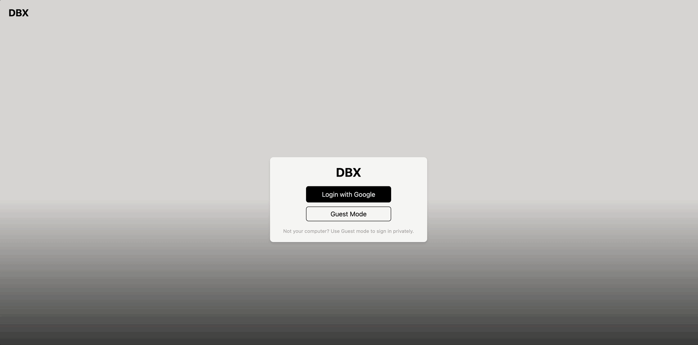
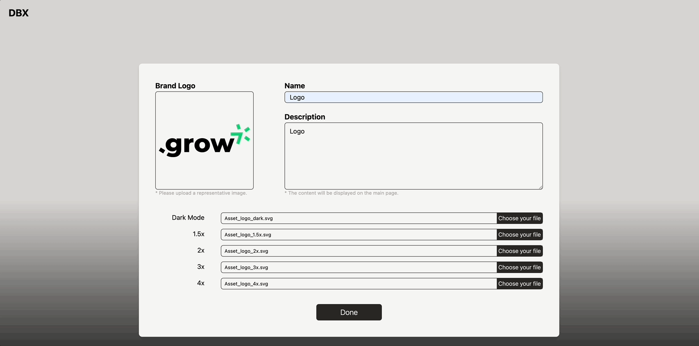
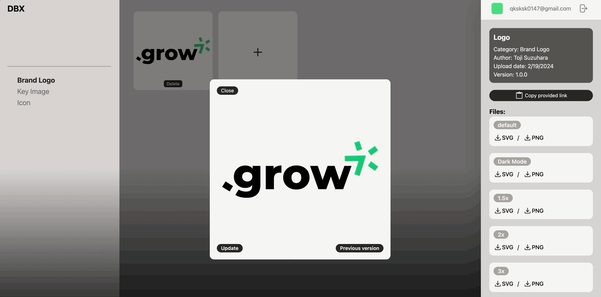
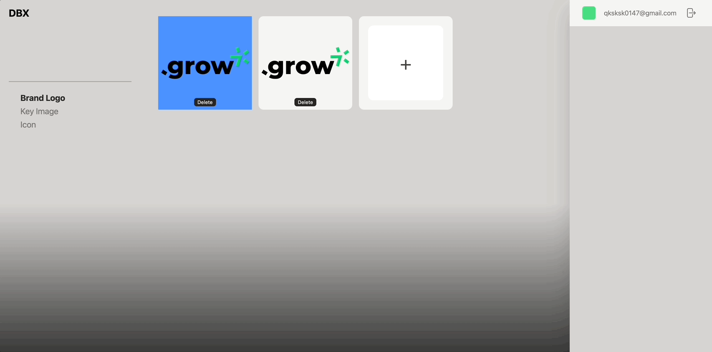
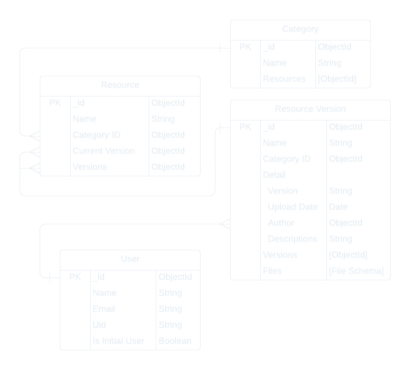

<h1 align="center">
  
</h1>

<br>

DBX is a web service that supports designers and developers in maintaining consistency in brand experience (BX) while efficiently managing graphic resources and versions. Consistency in BX is essential for enhancing customer trust and brand value. However, maintaining this consistency requires significant effort, manpower, and time.

DBX simplifies this process intuitively and offers various features that allow for easy maintenance of consistency with minimal effort. Access the resources you need easily from anywhere through a centralized library and share the outcomes of your work in real-time.

By using DBX, building and maintaining brand identity becomes much simpler, and both individuals and teams can devote more time to core tasks, thus improving the speed and quality of projects.

## Available Languages

- [한국어](README.ko.md)
- [English](README.md)

## Contents

- [Overview](#overview)
- [Key features & Technology Stack](#key-features--technology-stack)
  - [Graphic Resource Version Control](#1-graphic-resource-version-control)
  - [File Upload and Download](#2-file-upload-and-download)
  - [Providing a Fixed URL for Resources](#3-providing-a-fixed-url-for-resources)
- [Demonstration](#demonstration)
- [Challenges & Leaning](#challenges--leaning)
  - [Data Modeling and Relationship Setting](#data-modeling-and-relationship-setting)
  - [Implementing File Download System](#implementing-file-download-system)
  - [Refactoring and Decentralizing Component Responsibilities](#decentralizing-component-responsibilities)
  - [Enhanced Error Handling in API Endpoints](#enhanced-error-handling)
- [Key Points and Achievements](#key-points-and-achievements)
- [Installation and Running Instructions](#installation-and-running-instructions)
  - [Frontend](#installation-frontend)
  - [Backend](#installation-backend)
- [Schedule](#schedule)
- [Project contribution](#project-contribution)
- [Creator](#creator)

## Overview

**Background**:

When we hit a wall in searching for team project ideas through Google, we realized the need for fresh perspectives and new ideas. Thus, we began gathering information through conversations with acquaintances. Most ideas were familiar, having been considered at least once, but occasionally we stumbled upon intriguing topics. Still, we were unable to settle on a definitive theme, and fatigue gradually built up.

During this time, an opportunity arose to discuss project topics over coffee with a friend who works at a nearby company. This friend, a UI/UX designer, often collaborated with developers and shared several aspects they wished could be improved. This chance conversation provided us with new inspiration, and the issues identified in the actual collaboration process became the starting point for developing DBX.

**Project Goals and Motivation**:

The DBX project aims to facilitate smooth collaboration between designers and developers, providing a platform that efficiently manages and maintains consistency in brand identity (BI). This web service simplifies graphic resource and version control, enabling all team members to easily access and utilize the latest design guidelines and assets.

The motivation stemmed from real-world communication issues and collaboration difficulties between designers and developers. Through conversations with team members in the initial stages of the project, we learned about the everyday problems faced by many designers and developers during project progress. Insights gained from discussions with a UI/UX designer friend became the core idea for the DBX project.

DBX was developed to solve these problems. By creating an environment where designers and developers can understand each other's work and share changes in real-time, it enables more efficient and smooth collaboration. Additionally, it aims to maintain project consistency while simultaneously enhancing customer trust and brand value.

In conclusion, the DBX project seeks to strengthen communication between designers and developers and simplify project management, providing an environment where everyone can collaborate more effectively. This allows both individuals and teams to focus more on their core tasks and simultaneously improve the quality and speed of projects.

<br>

## Key features & Technology Stack

The DBX project is a platform designed to maximize collaboration between designers and developers, facilitating smooth version control and sharing of graphic resources. To achieve this goal, our team has selected a technology stack that is high-performing, scalable, and supported by a robust ecosystem. The following content explains the key features of DBX, along with the reasons and background for choosing these particular technologies.

### 1. Graphic Resource Version Control

**Feature Overview**: Designers can update the latest versions of graphic assets by category according to established rules and manage versions systematically. Now, there's no need for team members to exchange files directly through messenger. By simply uploading assets to DBX, all team members can easily access the appropriate versions of graphic resources that comply with the guidelines.

**Technology Used**: [MongoDB Atlas](https://www.mongodb.com/atlas)

**Selection Rationale**:

-MongoDB Atlas offers distinctive scalability and flexibility, making resource adjustment easy as data volume increases. Its high availability and robust security features ensure stable management and protection of critical data. Additionally, automated backup and recovery, along with real-time monitoring capabilities, further enhance data security and simplify system management.

<br>

### 2. File Upload and Download

**Feature Overview**: Designers can categorize their work through categories like 'Brand Logo', 'Key Image', 'Icon', etc., and directly upload files. This approach helps to systematically manage and store work, moving away from inconsistent naming conventions like 'final of final'. Moreover, uploading files tailored to widely used options such as 'Dark Mode', '1.5x scale', '2x scale', etc., can further strengthen the consistency of the work. Now, team members can easily download files that comply with the guidelines through DBX, without having to directly request them from the designer.

### 3. Providing a Fixed URL for Resources

**Feature Overview**: Every graphic resource uploaded by designers is assigned a unique, fixed URL. Developers can easily incorporate service logos, icons, etc., using this URL, and once connected, they can proceed with version updates without needing to replace files, as long as the resource does not change. Therefore, during service updates, maintaining the specific URL alone can avoid the hassle of directly exchanging files.

**Technology Used**: [sharp](https://sharp.pixelplumbing.com/), [Amazon S3(Simple Storage Service)](https://aws.amazon.com/pm/serv-s3/?nc1=h_ls) & [aws-sdk](https://aws.amazon.com/sdk-for-javascript/)

**Selection Rationale**:

-sharp is an image processing library for Node.js, used for converting SVG code into high-quality SVG and PNG files. This is necessary to meet various resolution and display requirements in web applications. Sharp is known for its outstanding image processing capabilities. It utilizes the libvips image processing library internally, enabling high-speed image processing while minimizing CPU usage.

-Amazon S3 (Simple Storage Service) is an object storage service that provides reliability, security, and exceptional scalability. The ability to store and manage large amounts of data, such as media files like graphic resources, is essential. S3 offers automatic scaling, allowing for increased storage space at any time, and operates on a pay-as-you-go basis, which provides flexibility as the scale of the project grows. Additionally, AWS offers industry-leading security features, making it suitable for managing a company's internal graphic resource library through detailed access management via bucket policies and IAM roles.

-aws-sdk is the official developer kit that facilitates integration with AWS services. It supports various programming languages, including Node.js and Python, allowing developers to easily integrate services like S3 into applications. This greatly aids in automating file upload and download processes and simplifying the development workflow.

<br>

## Demonstration

**Demo site**:

<br>

<div align="center">
  
  <p><em>User Initial Setup Demo - 1</em></p>
</div>

<br>

<div align="center">
  
  <p><em>User Initial Setup Demo - 2</em></p>
</div>

<br>

<div align="center">
  
  <p><em>Resource Version Update Demo</em></p>
</div>

<br>

<div align="center">
  
  <p><em>Resource Addition Demo</em></p>
</div>

<br>

<div align="center">
  
  <p><em>Version List Demo</em></p>
</div>

<br>

<div align="center">
  
  <p><em>Resource Deletion Demo</em></p>
</div>

<br>

## Challenges & Leaning

During the DBX team project, we encountered various unexpected situations through technical challenges and collaboration with team members. From establishing a suitable Git strategy for the project to reviewing each other's code, several elements that we had not experienced before were initially confusing. However, I believe these processes provided a valuable opportunity to contemplate and solve problems together with team members. Below are some of the challenges we faced during the DBX development process that were particularly memorable and provided significant learning experiences.

<details>
  <summary id="data-modeling-and-relationship-setting">Data Modeling and Relationship Setting</summary>

In the DBX project, version management of graphic resources was a core feature, necessitating systematic and intuitive data schema modeling. Initially, creating separate schemas for each category seemed like a solution. However, upon conducting actual simulations, we discovered that managing each category with independent schemas complicated the creation of RESTful API paths, and the paths increased proportionally with the addition of categories. This indicated the need to reconsider the project's structure and seek a more efficient solution.

<br>

<div align="center">
  
  <p><em>Schema Modeling</em></p>
</div>

<br>

**Learning Points and Solutions**:

**Integrated Category Management**: To solve the issue identified in the initial approach, where separate paths were needed for each category, we introduced a categorySchema, allowing for the integrated management of all graphic resources. This simplifies API design and addresses the problem of increasing paths with the number of categories. Each category is designed to have a unique name and can contain multiple resources.

**Clear Separation of Resource and Version Management**: By separating resourceSchema and resourceVersionSchema, we effectively manage the current and previous versions of resources. This structure clearly separates the metadata of resources from all their versions, making version management more straightforward. Developers can always access the latest version through a fixed URL or refer to a specific version as needed, facilitating smooth updates when necessary.

**Linking Detailed Information between Users and Versions**: Connecting userSchema and resourceVersionSchema allows for the management of detailed information (upload date, author, description, etc.) for each resource version. This simplifies the tracking and management of resource versions and enables detailed documentation for each version, enhancing collaboration and communication within and outside the team. Author information allows for tracking changes to resources and providing feedback on necessary revisions.

These schema modeling strategies have enabled systematic and intuitive version management of graphic resources in the DBX project, improving efficient collaboration among team members and the efficiency of resource management.

</details>

<br>

<details>
  <summary id="implementing-file-download-system">Implementing File Download System</summary>

In the initial stages of the DBX project, the file download functionality was implemented on the frontend, leading to a significant security issue where AWS access keys were exposed in the client-side code. To address this issue, a strategy was devised to move the file download logic from the frontend to the backend.

**Learning Points and Solutions**:

**Recognition of Security Issue**: The method of directly downloading AWS S3 objects from the frontend exposed the AWS access keys, creating a security risk. To resolve this issue, we shifted the file download logic to the backend, making the server act as an intermediary for file requests and transfers. This was a decisive measure to enhance security by keeping and managing the AWS access keys solely on the server.

**Before**:

```javascript
import AWS from "aws-sdk";

function ControlPanel({ email, resourceData, categoryId, resourceId }) {

  AWS.config.update({
    accessKeyId: import.meta.env.VITE_S3_ACCESS_KEY_ID,
    secretAccessKey: import.meta.env.VITE_S3_SECRET_ACCESS_KEY,
  });

export default ControlPanel;
```

_AWS configuration written inside the ControlPanel component on the frontend_

**After**:

```javascript
import useDownloadFile from "@/hooks/useDownloadFile";

function ControlPanel({ email, resourceData, categoryId, resourceId }) {

  const { download } = useDownloadFile();

export default ControlPanel;
```

_After the modification, only the logic to request downloads is used in the frontend._

```javascript
const downloadResourceFile = async (req, res) => {
  const fileUrl = req.query.url;

  try {
    const response = await axios.get(fileUrl, { responseType: "arraybuffer" });

    const fileName = fileUrl.split("/").pop();

    res.setHeader("Content-Disposition", `attachment; filename="${fileName}"`);
    res.setHeader("Content-Type", "application/octet-stream");

    const buffer = Buffer.from(response.data, "binary");

    res.send(buffer);
  } catch (error) {
    console.error(error);

    res.status(500).json({
      status: "Error",
      message: "Error downloading the file.",
    });
  }
};
```

_Moved the download logic to the backend, changing the server to act as an intermediary for file requests and transfers._

**Backend Implementation**: In the backend, upon receiving a file URL request, axios is used to securely request the file from S3. The requested file is received in the form of an arraybuffer, converted into a Buffer, and then transmitted to the client, allowing the user to directly download the file. During this process, the Content-Disposition header is set to prompt the user to download the file.

**Error Management**: To ensure system stability, error handling logic is implemented to prepare for potential exceptions that may occur during the file request process. In case of an error, an error message is returned to the user along with a 500 status code to clearly communicate the issue.

This approach has strengthened the security of the file download feature and provided users with a stable file download experience. This process was a valuable opportunity to learn about enhancing both the security and functionality of a project through collaboration between the frontend and backend.

</details>

<br>

<details>
  <summary id="decentralizing-component-responsibilities">Refactoring and Decentralizing Component Responsibilities</summary>

The initial state of the DBX project's code was quite confusing. While using React, there were shortcomings in state management, misunderstandings and misuses of React hooks, and complex logic that posed significant challenges during refactoring. To address these issues, we underwent a systematic refactoring process to simplify complex logic and allow each component to focus only on its designated functionalities. This process served as a valuable opportunity for us to reassess and reflect on the code we had written.

**Learning Points and Solutions**:

**Improving Code Readability and Maintainability**: Before refactoring, the code had various state management and business logics concentrated in a single component, which reduced readability and maintainability. Through refactoring, by modularizing repeated logics, the responsibilities of the parent component were reduced. This made the code more concise and clarified the roles of each part. Below is an example of `ResourceList`, which has the most subcomponents.

**Before**:

```javascript
function ResourceList({ setCategoriesId }) {
  const user = useContext(UserContext);
  const { userEmail, isAdmin, categoriesId } = user;
  const { category } = useParams();
  const [resourcesUrl, setResourcesUrl] = useState([]);
  const [resourcesData, setResourcesData] = useState([]);
  const [selectedImageData, setSelectedImageData] = useState(null);
  const [selectedResourceId, setSelectedResourceId] = useState(null);
  const [selectedCategoryId, setSelectedCategoryId] = useState(null);
  const navigate = useNavigate();

  async function getCategoriesId() {
    const response = await axios.get(
      `${import.meta.env.VITE_SERVER_URL}/categories`,
    );
    setCategoriesId(response.data.categories);
  }

  useEffect(() => {
    getCategoriesId();
  }, []);

  const fetchData = useCallback(async () => {
    try {
      const categoryId = categoriesId.find(
        (item) => item.name === category,
      )?._id;
      const response = await axios.get(
        `${import.meta.env.VITE_SERVER_URL}/categories/${categoryId}`,
      );
      setResourcesUrl(response.data.categoryList.map((item) => item.svgUrl));
      setResourcesData(response.data.categoryList);
    } catch (error) {
      console.error(
        "There was an issue loading your data. Please try again later.",
      );
    }
  }, [category, categoriesId]);

  useEffect(() => {
    if (categoriesId) {
      fetchData();
    }
  }, [fetchData]);

  const handleCategoryChange = (newCategory) => {
    navigate(`/resource-list/${newCategory}`);
  };

  const handleImageSelect = async (imageId) => {
    setSelectedResourceId(imageId);

    if (imageId === null) {
      setSelectedImageData(null);

      return;
    }

    try {
      const categoryId = categoriesId.find(
        (item) => item.name === category,
      )?._id;
      setSelectedCategoryId(categoryId);
      const response = await axios.get(
        `${
          import.meta.env.VITE_SERVER_URL
        }/categories/${categoryId}/resources/${imageId}`,
      );
      setSelectedImageData(response.data);
    } catch (error) {
      toast.error(
        "There was an issue loading your data. Please try again later.",
      );
    }
  };

  return (
    <div className="flex w-screen h-screen">
      <CategoryBar
        categories={categoriesId ? categoriesId.map((item) => item.name) : []}
        activeCategory={category}
        onChangeCategory={handleCategoryChange}
      />
      <ImageGrid
        svgUrl={resourcesUrl}
        data={resourcesData}
        onImageSelect={handleImageSelect}
        isAdmin={isAdmin}
        categoryName={category}
        fetchData={fetchData}
      />
      <ControlPanel
        email={userEmail}
        resourceData={selectedImageData}
        categoryId={selectedCategoryId}
        resourceId={selectedResourceId}
      />
    </div>
  );
}

export default ResourceList;
```

_The `ResourceList` component, with complex logic for managing the states of all subcomponents_

```javascript
function ResourceList() {
  const { currentCategoryPath } = useParams();
  const dispatch = useDispatch();
  const categoryIds = useSelector((state) => state.user.categoryIds);
  const categoryId = categoryIds.find(
    (category) => category.name === currentCategoryPath,
  )?.id;

  useEffect(() => {
    dispatch(clearResourceInfo());
  }, [currentCategoryPath]);

  const { urlList, requestData, isLoading, fetchData } =
    useFetchResourceList(categoryId);

  return (
    <div className="flex w-screen h-screen">
      <CategoryBar />

      {isLoading ? (
        <div className="relative w-3/5 p-10 overflow-auto h-screen">
          Loading...
        </div>
      ) : (
        <ImageGrid list={urlList} data={requestData} refreshData={fetchData} />
      )}

      <ControlPanel />
    </div>
  );
}

export default ResourceList;
```

_The `ResourceList` component, where responsibilities are decentralized and logic is simplified through refactoring_

**Centralization of State Management**: Before refactoring, managing multiple states within components made tracking state flow difficult. By centralizing state management in the Redux store using useDispatch and useSelector, we increased the transparency and predictability of state update logic. This made the overall application's state management more systematic.

**Performance Optimization and User Experience Improvement**: Attempting to process all logic at once during initial loading caused delays and negatively affected user experience. Introducing an isLoading state to manage the data loading status and clearly indicating loading states to users improved user experience. Additionally, by efficiently fetching only the necessary data and minimizing unnecessary re-renders, we optimized performance.

Through this refactoring process, the overall structure and code quality of the application were enhanced. Decentralizing component responsibilities gave each part a clearer role, creating an environment that made it easier for team members to understand and collaborate on the code. Furthermore, centralized state management and performance optimization provided a faster and more stable user experience.

</details>

<br>

<details>
  <summary id="enhanced-error-handling">Enhanced Error Handling in API Endpoints</summary>

The initial backend logic of the DBX project encompassed various issues, particularly a lack of consistency in error handling, which made it difficult to identify points of failure during the refactoring process due to inadequate error logging.

**Learning Points and Solutions**:

**Improvement in Clarity of Error Handling**: Before refactoring, error handling was inconsistent, and in some cases, it relied solely on specific error messages (e.g., "Unauthorized"). This made it difficult to flexibly respond to various error situations. After refactoring, error handling was strengthened in a clear and consistent manner. For example, access was restricted for non-initial users, and clear error messages were returned when essential images ('Default' images) were not registered. This approach clearly communicates error situations to both developers and users, providing guidance for error resolution.

```javascript
const login = async function (req, res, next) {
  if (!idToken || !email) {
    res.status(400).json({
      result: "Error",
      message: "Both idToken and email are required",
    });
    return;
  }

  try {
    const authenticatedUser = await getAuth().verifyIdToken(idToken);

    if (authenticatedUser.email !== email) {
      throw new Error("Unauthorized");
    }
  } catch (error) {
    if (error.message === "Unauthorized") {
      res.statusCode = 401;
      res.json({
        result: "Error",
        message: "401 Invalid User",
      });
    } else {
      next(error);
    }
  }
};
```

_Existing error handling logic_

```javascript
const initialRegistration = async (req, res) => {
  if (!req.user.isInitialUser) {
    res.status(403).json({ status: "Error", message: "Not initial user." });

    return;
  }

  try {
    const isDefault = data.files.find((file) => file.option === "default");

    if (!isDefault) {
      res.status(400).json({
        status: "Error",
        message: "You must register the 'Default' image.",
      });

      return;
    }

    const category = await Category.findById(brandLogoCategoryId);

    if (!category) {
      res.status(404).json({
        status: "Error",
        message: "Category not found.",
      });

      return;
    }
  } catch (error) {
    console.error(error);

    res.status(500).json({
      status: "Error",
      message: "Server encountered an error processing the request.",
    });
  }
};
```

_Error handling logic written to anticipate possible scenarios where errors could occur_

**Strengthening Error Handling**: In the initial logic, server-side exception handling was not adequately performed, leading to situations where appropriate responses were not provided in the event of unexpected errors. During the refactoring process, we utilized try-catch blocks to enhance exception handling across server-side logic comprehensively. Additionally, we improved the system to return appropriate HTTP status codes and error messages for all possible error scenarios. This enhances the server's stability and provides clearer error information to the client.

**Ease of Error Logging and Debugging**: Before refactoring, insufficient debugging information was provided when errors occurred, making it difficult to identify the cause of problems. After refactoring, error logging was added to the error handling logic, ensuring detailed information is printed to the console when errors occur. This helps developers quickly understand the cause of errors and assists in problem-solving.

Through these improvements, the refactored code more effectively manages error situations, providing a more stable service to users and serving as a reminder of the importance of error handling.

</details>

<br>

## Key Points and Achievements

**Improvement in Code Readability and Maintainability**: By decentralizing component responsibilities and simplifying complex logics, we enhanced the overall readability and maintainability of the code.

**Centralization of State Management**: Utilizing Redux to centralize the application's state management increased the consistency and predictability of state updates.

**Performance Optimization and User Experience Enhancement**: By managing data loading states and optimizing necessary data requests, we improved performance and user experience.

**Strengthening Error Handling**: By enhancing and clarifying error handling logic, we increased the system's stability and provided clearer feedback to users.

**Enhanced Security**: By moving critical logic to the server side, we strengthened security and reduced the risk of exposing sensitive information.

Through this improvement process, we were reminded of the importance of code quality and architecture in development projects. The experience of solving initially complex and challenging problems through systematic approach and refactoring was invaluable. Especially, the process of resolving issues through close cooperation with team members not only fostered growth as a developer but also allowed us to experience the synergy as a team.

Moreover, experiencing firsthand the importance of security and performance optimization, and recognizing the significance of prioritizing user experience in development, were profound lessons. The knowledge and experience gained through this process will be a significant asset in future development activities and serve as a stepping stone to becoming a better developer.

## Installation and Running Instructions

<details>
  <summary id="installation-frontend">Frontend</summary>

**Environmental Requirements**

- Node.js v18.18.1 or higher
- npm v9.8.1 (installed along with Node.js)

**Installation Procedure**

**Project Clone**

```bash
git clone https://github.com/koreanerd/project-DBX-Frontend.git
```

**Installation of Dependencies**

```
npm install
```

Create a .env file in the project root directory.

```bash
VITE_BACKEND_URL=http://localhost:3000 # The default port for the project's backend is 3000.

# The area below is where you enter the information you received from Firebase.

VITE_FIREBASE_API_KEY=
VITE_FIREBASE_AUTH_DOMAIN=
VITE_FIREBASE_PROJECT_ID=
VITE_FIREBASE_STORAGE_BUCKET=
VITE_FIREBASE_MESSAGING_SENDER_ID=
VITE_FIREBASE_APP_ID=
VITE_FIREBASE_MEASUREMENT_ID=
```

**Execution Commands**

Development mode

```bash
npm run dev
```

Production mode

```bash
npm run build
```

</details>

<br>

<details>
  <summary id="installation-backend">Backend</summary>

**nvironmental Requirements**

- Node.js v18.18.1 or higher
- npm v9.8.1 (installed along with Node.js)

**Installation Procedure**

**Project Clone**

```bash
git clone https://github.com/koreanerd/project-DBX-Backend.git
```

**Installation of Dependencies**

```
npm install
```

Create a .env file in the project root directory.

```bash
CONNECTION_URI= # Please enter your MongoDB Connection String.

FRONTEND_URL=http://localhost:5173 # he default port for the project's frontend is 5173.

# The area below is where you enter the information you received from Firebase.
# The FIREBASE_PRIVATE_KEY_ID value is very long, so pay attention to proper line breaks.
# Considering the AWS deployment for the Core City project, use @ instead of \n, and then use .replace(/@/g, "\n") in the code to handle line breaks.

FRONTEND_URL=
FIREBASE_TYPE=
FIREBASE_PROJECT_ID=
FIREBASE_PRIVATE_KEY_ID=
FIREBASE_PRIVATE_KEY=
FIREBASE_CLIENT_EMAIL=
FIREBASE_CLIENT_ID=
FIREBASE_AUTH_URI=
FIREBASE_TOKEN_URI=
FIREBASE_AUTH_PROVIDER_CERT_URL=
FIREBASE_CLIENT_CERT_URL=
FIREBASE_UNIVERSE_DOMAIN=

# In the section below, you should register the keys you have obtained through setting up S3 buckets and IAM users in AWS.
AWS_BUCKET_NAME=
AWS_BUCKET_URL=
AWS_ACCESS_KEY_ID=
AWS_SECRET_ACCESS_KEY=
AWS_REGION=
```

**Execution Commands**

Development mode

```bash
npm run dev
```

</details>

## Schedule

**Project Duration**: July 10, 2023 ~ August 3, 2023 / Planning 10 days, Development 15 days

**Detailed content for each week**

1st week:

- Collecting and reviewing ideas, setting rules for smooth collaboration with team members including Git strategy.
- Sketching ideas and creating mockups of the project using Figma.
- Setting up Notion for schedule management and task allocation.

2nd ~ 3rd week:

- Setting up husky, eslint, lint-staged, and writing boilerplate code.
- Familiarizing with S3 usage and initial setup.
- Configuring Firebase authentication.
- Implementing backend functionalities.
- Implementing frontend functionalities.
- Team project presentation.

## Project contribution

**Before refactoring**:

<details>
  <summary>Frontend</summary>

| Tasks             | 전세원 | 조빈 |
| ----------------- | -----: | ---: |
| Login             |    50% |  50% |
| New Resource Form |    10% |  90% |
| Resource Card     |    10% |  90% |
| Resource List     |    10% |  90% |
| Resource Modal    |    10% |  90% |
| Resource Version  |    10% |  90% |
| New Version Form  |    10% |  90% |

</details>

<br/>

<details>
  <summary>Backend</summary>

| Tasks             | 전세원 | 조빈 |
| ----------------- | -----: | ---: |
| Login             |    90% |  10% |
| New Resource Form |    90% |  10% |
| Resource Card     |    90% |  10% |
| Resource List     |    90% |  10% |
| Resource Modal    |    90% |  10% |
| Resource Version  |    90% |  10% |
| New Version Form  |    90% |  10% |

</details>

<br/>

**After refactoring**:

<details>
  <summary>Frontend</summary>

| Tasks                  | 조빈 |
| ---------------------- | ---: |
| Login                  | 100% |
| Resource Form          | 100% |
| Resource List          | 100% |
| Resource Grid          | 100% |
| Resource Modal         | 100% |
| Resource Category Bar  | 100% |
| Resource Control Panel | 100% |
| Resource Version List  | 100% |

</details>

<br/>

<details>
  <summary>Backend</summary>

| Tasks            | 조빈 |
| ---------------- | ---: |
| Users Route      | 100% |
| Categories Route | 100% |
| Controllers      | 100% |
| AWS S3           | 100% |

</details>

<br/>

> Refactoring was carried out by each team member independently.

## Creator

[전세원](https://github.com/sewonjun)<br>
[조빈](https://github.com/koreanerd)
